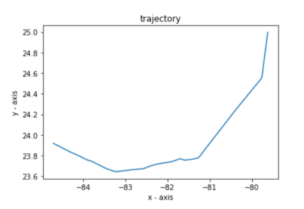
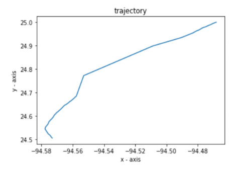
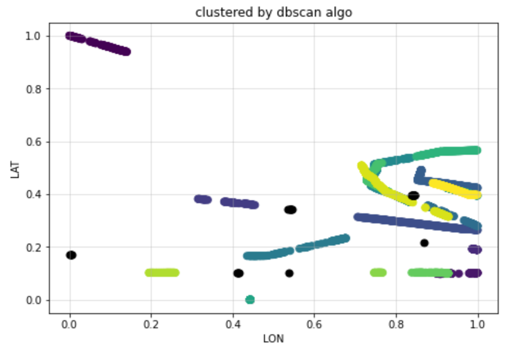

# Vessel Trajectory Prediction Using AIS Data

## Overview
This project focuses on analyzing vessel trajectories using **AIS (Automatic Identification System)** data, aiming to predict trajectories that will help in collision avoidance, destination prediction etc with data cleaning, clustering, and forecasting techniques. The project is conducted under the guidance of **Dr. Luo Wei** at **GeoSpatialX Lab**.

### Team Members:
- **Katkuri Aditya Vardhan Reddy**
- **Shubham Sharma**

---

 ## Dataset Information

- **Initial Dataset Used**: `AIS_2022_01_01`
- **Dataset Procured From**: [Marine Cadastre AIS Data Portal](https://marinecadastre.gov/ais/)
- **Dataset Size**: 7,239,758 × 17 (7,239,758 data points and 17 variables)
- **Vessel Type**: Vessel Type ‘80’ was selected, which are tanker vessels.

## Workflow

1. **Data Cleaning**:
- Remove invalid data points, such as incorrect MMSI entries i.e., no. of digits in MMSI greater or lesser than 9.
- Filter latitude values to the range of 20–25 degrees while keeping longitude unrestricted to allow longer trajectory length and narrow down the area of focus for easier analysis.

### Cleaned Trajectory Examples:

    
    

2. **Clustering**:
   - Applied the **DBSCAN** (Density-Based Spatial Clustering of Applications with Noise) algorithm to identify clusters and outliers.
   - Resulted in 18 clusters, with 1 identified outlier removed.

  

3. **Trajectory Prediction**:
   - Used the **VARMAX (Vector Autoregressive Moving-Average with Exogenous Regressors)** model for trajectory prediction.
   - Predictions were validated by comparing them with known trajectory points.

## Key Insights

- Data cleaning and filtering ensure high-quality inputs for clustering and forecasting.
- DBSCAN effectively segmented the dataset, identifying clusters and removing noise.
- VARMAX provided robust trajectory predictions when trained on sufficient high-quality data.

---

## Future Directions

1. Perform advanced trajectory prediction for individual vessels using multiple models.
2. Expand the dataset by incorporating additional AIS datasets (e.g., AIS_01_02, AIS_03).
3. Develop dynamic and interactive visualizations for the predictions using **React.js**.
4. Further optimize accuracy and computational efficiency of the prediction models.
